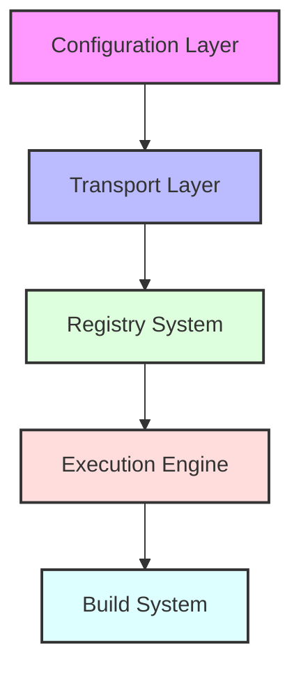

This guide covers the core concepts and architecture of the DyneMCP framework, helping you understand how to build sophisticated MCP servers.

## Architecture Overview

DyneMCP follows a modular architecture designed for scalability and maintainability:



## Server Initialization

The core of DyneMCP is the server initialization process:

```typescript
import { createMCPServer } from '@dynemcp/dynemcp'

// Create a server instance
const server = createMCPServer(
  'my-server', // Optional server name
  'dynemcp.config.json', // Optional config path
  '1.0.0' // Optional version
)

// Initialize and start the server
await server.start()
```

### Server Configuration

The server can be configured through `dynemcp.config.json`:

```json
{
  "server": {
    "name": "my-mcp-server",
    "version": "1.0.0",
    "documentationUrl": "https://example.com/docs"
  },
  "tools": {
    "enabled": true,
    "directory": "./src/tools",
    "pattern": "**/*.{ts,js}"
  },
  "resources": {
    "enabled": true,
    "directory": "./src/resources",
    "pattern": "**/*.{ts,js}"
  },
  "prompts": {
    "enabled": true,
    "directory": "./src/prompts",
    "pattern": "**/*.{ts,js}"
  },
  "transport": {
    "type": "stdio"
  },
  "logging": {
    "enabled": true,
    "level": "info",
    "format": "text",
    "timestamp": true,
    "colors": true
  },
  "debug": {
    "enabled": false,
    "verbose": false,
    "showComponentDetails": false,
    "showTransportDetails": false
  },
  "performance": {
    "maxConcurrentRequests": 100,
    "requestTimeout": 30000,
    "memoryLimit": "512mb",
    "enableMetrics": false
  },
  "security": {
    "enableValidation": true,
    "strictMode": false,
    "allowedOrigins": ["*"],
    "rateLimit": {
      "enabled": false,
      "maxRequests": 100,
      "windowMs": 900000
    }
  }
}
```

## Transport System

DyneMCP supports multiple transport types:

### stdio Transport (Default)

```json
{
  "transport": {
    "type": "stdio"
  }
}
```

### HTTP Transport

```json
{
  "transport": {
    "type": "http",
    "options": {
      "port": 3000,
      "host": "localhost"
    }
  }
}
```

### SSE Transport

```json
{
  "transport": {
    "type": "sse",
    "options": {
      "port": 3000,
      "endpoint": "/sse",
      "messageEndpoint": "/message",
      "cors": {
        "allowOrigin": "*",
        "allowMethods": "GET,POST",
        "allowHeaders": "Content-Type"
      }
    }
  }
}
```

### HTTP-Stream Transport

```json
{
  "transport": {
    "type": "http-stream",
    "options": {
      "port": 4000,
      "responseMode": "stream",
      "authentication": {
        "path": "./src/auth.ts"
      },
      "session": {
        "enabled": true
      },
      "resumability": {
        "enabled": true
      }
    }
  }
}
```

## Dynamic Registry

The registry system allows dynamic registration of components:

```typescript
const server = createMCPServer()

// Register tools dynamically
server.registry.registerTool({
  name: 'dynamic-tool',
  description: 'A dynamically registered tool',
  schema: z.object({}),
  handler: async () => 'Dynamic response',
})

// Register resources
server.registry.registerResource({
  uri: 'dynamic://resource',
  name: 'Dynamic Resource',
  content: 'Dynamic content',
})

// Register prompts
server.registry.registerPrompt({
  id: 'dynamic-prompt',
  name: 'Dynamic Prompt',
  content: 'Dynamic prompt content',
})
```

## Model Sampling

DyneMCP includes built-in support for LLM model sampling:

```typescript
const sampleTool = {
  name: 'sample-model',
  description: 'Samples a model for completion',
  schema: z.object({
    prompt: z.string(),
    maxTokens: z.number().optional(),
  }),
  handler: async ({ prompt, maxTokens = 100 }) => {
    const response = await server.sampleModel({
      messages: [{ role: 'user', content: prompt }],
      maxTokens,
    })
    return response.content
  },
}
```

## Security Features

### Authentication

```typescript
// auth.ts
import { Request, Response, NextFunction } from 'express'

export default function authenticate(
  req: Request,
  res: Response,
  next: NextFunction
) {
  const token = req.headers.authorization

  if (!token || !isValidToken(token)) {
    return res.status(401).json({ error: 'Unauthorized' })
  }

  next()
}
```

### Rate Limiting

Rate limiting can be configured in `dynemcp.config.json`:

```json
{
  "security": {
    "rateLimit": {
      "enabled": true,
      "maxRequests": 100,
      "windowMs": 900000
    }
  }
}
```

## Performance Monitoring

DyneMCP includes built-in performance monitoring:

```typescript
const server = createMCPServer()

// Access server statistics
console.log(server.stats)

// Enable metrics
server.config.performance.enableMetrics = true
```

## Advanced Features

### Hot Reload Development

The framework supports hot reload during development:

```bash
dynemcp dev
```

### Build System

Optimized build system using esbuild:

```typescript
import { build, BuildConfig } from '@dynemcp/dynemcp'

const config: BuildConfig = {
  input: './src/index.ts',
  output: './dist',
  target: 'node18',
  minify: true,
  sourcemap: true,
}

await build(config)
```

### Debugging Tools

Comprehensive debugging capabilities:

```json
{
  "debug": {
    "enabled": true,
    "verbose": true,
    "showComponentDetails": true,
    "showTransportDetails": true
  }
}
```
