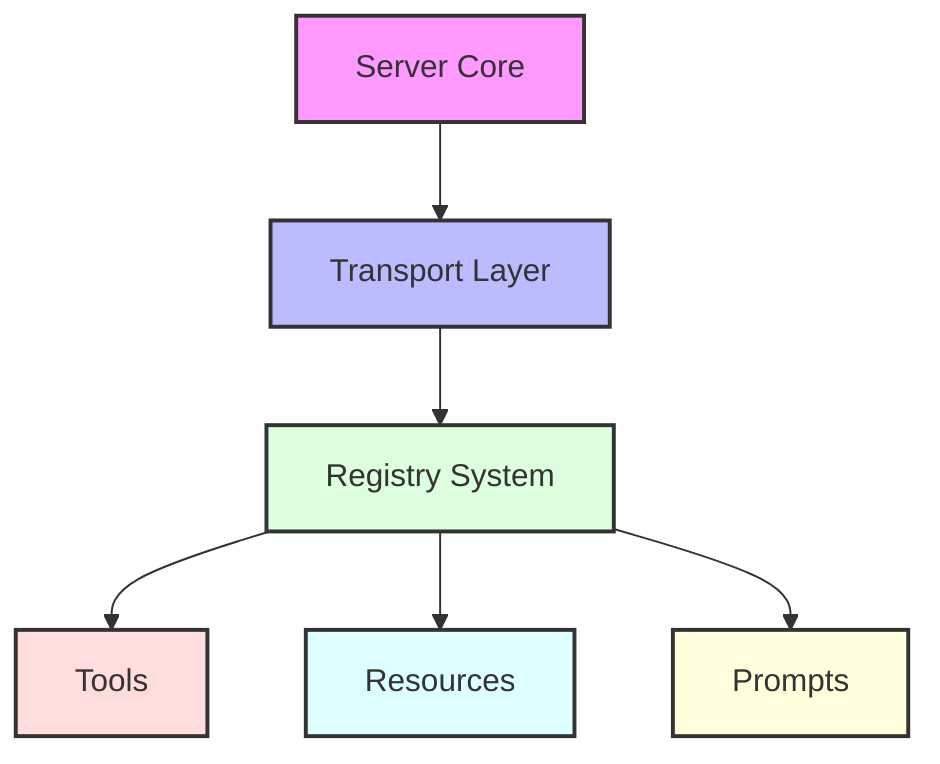

This guide covers the core concepts and architecture of the DyneMCP framework, helping you understand how to build sophisticated MCP servers.

## Architecture Overview

DyneMCP follows a modular architecture designed for scalability and maintainability:



## Server Initialization

The core of DyneMCP is the server initialization process:

```typescript
import { createMCPServer } from '@dynemcp/dynemcp'

// Create a server instance
const server = createMCPServer()

// Initialize and start the server
await server.init()
```

### Server Configuration

The server can be configured through `dynemcp.config.json`:

```json
{
  "server": {
    "name": "my-mcp-server",
    "version": "1.0.0",
    "documentationUrl": "https://example.com/docs"
  },
  "tools": {
    "enabled": true,
    "directory": "./src/tools",
    "pattern": "**/*.{ts,js}"
  },
  "resources": {
    "enabled": true,
    "directory": "./src/resources",
    "pattern": "**/*.{ts,js}"
  },
  "prompts": {
    "enabled": true,
    "directory": "./src/prompts",
    "pattern": "**/*.{ts,js}"
  },
  "transport": {
    "type": "stdio"
  },
  "logging": {
    "enabled": true,
    "level": "info",
    "format": "text",
    "timestamp": true,
    "colors": true
  },
  "debug": {
    "enabled": false,
    "verbose": false,
    "showComponentDetails": false,
    "showTransportDetails": false
  },
  "performance": {
    "maxConcurrentRequests": 100,
    "requestTimeout": 30000,
    "memoryLimit": "512mb",
    "enableMetrics": false
  },
  "security": {
    "enableValidation": true,
    "strictMode": false,
    "allowedOrigins": ["*"],
    "rateLimit": {
      "enabled": false,
      "maxRequests": 100,
      "windowMs": 900000
    }
  }
}
```

## Transport System

DyneMCP supports two transport types:

### stdio Transport (Default)

```json
{
  "transport": {
    "type": "stdio"
  }
}
```

### HTTP Stream Transport

```json
{
  "transport": {
    "type": "http-stream",
    "options": {
      "port": 3000,
      "endpoint": "/mcp"
    }
  }
}
```

## Component Registry

The registry system manages tools, resources, and prompts:

```typescript
import { z } from 'zod'
import type { ToolDefinition, ResourceDefinition } from '@dynemcp/dynemcp'

const server = createMCPServer()

// Register a tool
const calculatorTool: ToolDefinition = {
  name: 'calculator',
  description: 'Basic calculator operations',
  schema: z.object({
    operation: z.string(),
    a: z.number(),
    b: z.number(),
  }),
  handler: async ({ operation, a, b }) => {
    switch (operation) {
      case 'add':
        return a + b
      case 'subtract':
        return a - b
      default:
        throw new Error('Invalid operation')
    }
  },
}
server.registry.addTool(calculatorTool)

// Register a resource
const mathResource: ResourceDefinition = {
  uri: 'data://math',
  name: 'Math Reference',
  content: {
    operations: ['add', 'subtract', 'multiply', 'divide'],
    constants: {
      pi: Math.PI,
      e: Math.E,
    },
  },
}
server.registry.addResource(mathResource)
```

## Error Handling

DyneMCP provides built-in error handling:

```typescript
try {
  const result = await server.execute('calculator', {
    operation: 'add',
    a: 1,
    b: 2,
  })
  console.log('Result:', result)
} catch (error) {
  if (error instanceof ValidationError) {
    console.error('Invalid input:', error.message)
  } else if (error instanceof ToolExecutionError) {
    console.error('Tool execution failed:', error.message)
  } else {
    console.error('Unexpected error:', error)
  }
}
```
