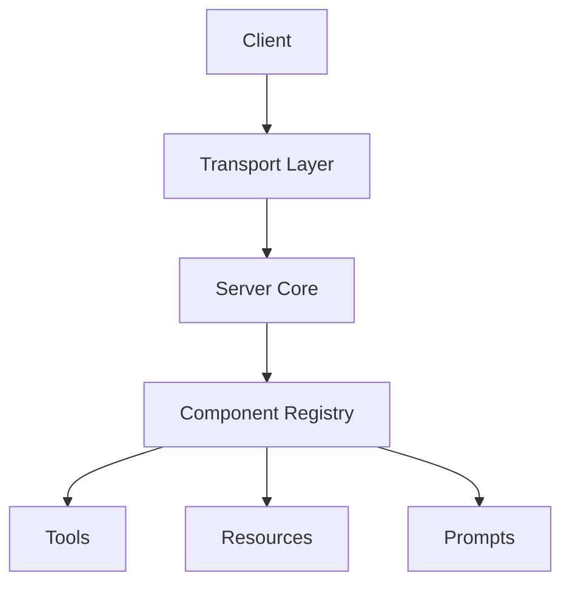
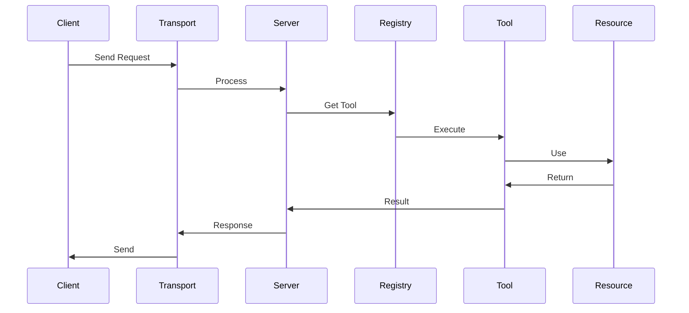
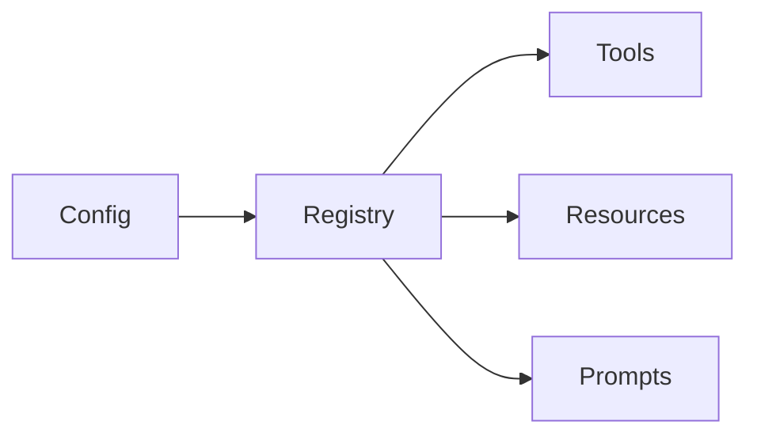

# Architecture Guide

This guide provides a comprehensive overview of DyneMCP's architecture, design principles, and core components.

## System Overview

DyneMCP is built on several key architectural principles:

1. Modular Design
2. Type Safety
3. Extensibility
4. Component-Based Architecture

### High-Level Architecture



## Core Components

### 1. Server Core

The central component that manages the MCP server lifecycle:

```typescript
export class DyneMCP {
  private server: McpServer
  private config: DyneMCPConfig
  public readonly registry = registry

  constructor(name?: string, configPath?: string, version?: string) {
    this.config = loadConfig(configPath)
    if (name) this.config.server.name = name
    if (version) this.config.server.version = version
  }

  async init(): Promise<void> {
    // Load all components using unified registry
    await registry.loadAll({
      tools: this.config.tools,
      resources: this.config.resources,
      prompts: this.config.prompts,
    })
  }

  async start(): Promise<void> {
    await this.init()
    const transportConfig = this.config.transport || { type: 'stdio' }
    this.transport = createTransport(transportConfig)
    await this.transport.connect(this.server)
  }
}
```

### 2. Component Registry

Manages all registered components:

```typescript
export class Registry {
  private storage = new ComponentStorage()

  async loadAll(options: LoadAllOptions): Promise<void> {
    const result = await loadAllComponents(options)
    this.storage.addTools(result.tools)
    this.storage.addResources(result.resources)
    this.storage.addPrompts(result.prompts)
  }

  getAllTools(): ToolDefinition[] {
    return this.storage.getAllTools()
  }

  getAllResources(): ResourceDefinition[] {
    return this.storage.getAllResources()
  }

  getAllPrompts(): PromptDefinition[] {
    return this.storage.getAllPrompts()
  }
}
```

### 3. Transport Layer

Handles communication protocols:

```typescript
export interface Transport {
  connect(server: McpServer): Promise<void>
  disconnect?(): Promise<void>
}

// Available Transport Types:
// 1. stdio (default)
// 2. http-stream
```

## Data Flow

### Request Processing



### Component Loading



## Design Patterns

### 1. Factory Pattern

Used for creating components:

```typescript
export class TransportFactory {
  static create(type: string, options: any): Transport {
    switch (type) {
      case 'http':
        return new HTTPTransport(options)
      case 'ws':
        return new WebSocketTransport(options)
      case 'stdio':
        return new StdioTransport(options)
      default:
        throw new Error(`Unknown transport: ${type}`)
    }
  }
}
```

### 2. Observer Pattern

Used for event handling:

```typescript
export class EventEmitter {
  private handlers = new Map<string, Set<Handler>>()

  on(event: string, handler: Handler) {
    const handlers = this.handlers.get(event) || new Set()
    handlers.add(handler)
    this.handlers.set(event, handlers)
  }

  emit(event: string, data: any) {
    const handlers = this.handlers.get(event)
    if (handlers) {
      for (const handler of handlers) {
        handler(data)
      }
    }
  }
}
```

### 3. Strategy Pattern

Used for different implementations:

```typescript
export interface CacheStrategy {
  get(key: string): Promise<any>
  set(key: string, value: any): Promise<void>
  delete(key: string): Promise<void>
}

export class MemoryCache implements CacheStrategy {
  private store = new Map()

  async get(key: string) {
    return this.store.get(key)
  }

  async set(key: string, value: any) {
    this.store.set(key, value)
  }
}

export class RedisCache implements CacheStrategy {
  private client: Redis

  async get(key: string) {
    return this.client.get(key)
  }

  async set(key: string, value: any) {
    await this.client.set(key, value)
  }
}
```

## Extension Points

### 1. Custom Tools

```typescript
export class CustomTool extends DyneMCPTool {
  get name() {
    return 'custom'
  }

  readonly schema = z.object({
    input: z.string(),
  })

  async execute(params: any) {
    // Custom implementation
  }
}
```

### 2. Custom Transport

```typescript
export class CustomTransport implements Transport {
  readonly type = 'custom'

  constructor(options: CustomOptions) {
    // Initialize
  }

  async start() {
    // Start transport
  }

  async send(message: any) {
    // Send message
  }
}
```

### 3. Custom Security

```typescript
export class CustomAuth implements Authentication {
  async verify(token: string) {
    // Custom verification
  }

  async generate(user: User) {
    // Generate token
  }
}
```

## Best Practices

### 1. Component Design

- Keep components focused
- Use dependency injection
- Follow SOLID principles
- Implement interfaces

### 2. Error Handling

- Use custom errors
- Provide context
- Handle async errors
- Log appropriately

### 3. Testing

- Unit test components
- Integration test flows
- Mock dependencies
- Test edge cases

### 4. Performance

- Use caching
- Optimize resources
- Monitor metrics
- Profile code

## Architecture Decisions

### 1. TypeScript

- Type safety
- Better tooling
- Modern features
- Large ecosystem

### 2. Modular Design

- Easy to extend
- Easy to test
- Easy to maintain
- Easy to deploy

### 3. Security First

- Built-in features
- Best practices
- Regular updates
- Audit support

### 4. Performance Focus

- Optimized core
- Caching system
- Resource management
- Monitoring tools
