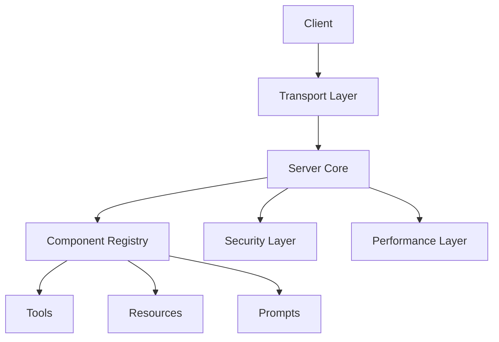
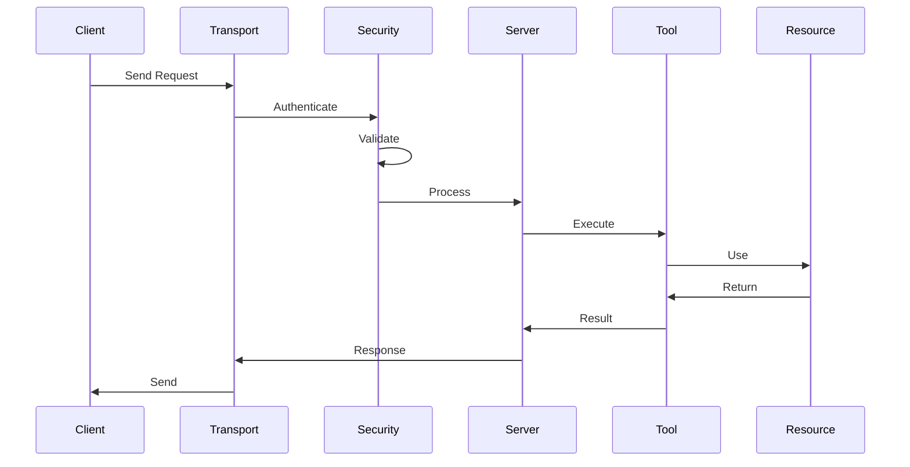
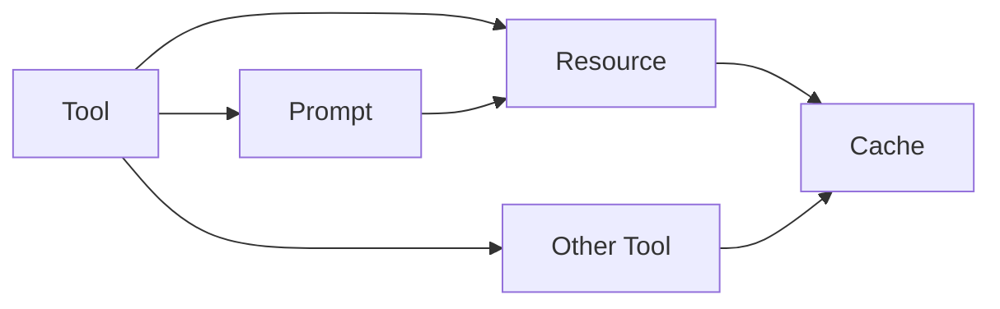

# Architecture Guide

This guide provides a comprehensive overview of DyneMCP's architecture, design principles, and core components.

## System Overview

DyneMCP is built on several key architectural principles:

1. Modular Design
2. Type Safety
3. Extensibility
4. Security First
5. Performance Optimization

### High-Level Architecture



## Core Components

### 1. Server Core

The central component that manages the MCP server lifecycle:

```typescript
export class MCPServer {
  private registry: Registry
  private transport: Transport
  private security: Security
  private performance: Performance

  constructor(options: ServerOptions) {
    this.registry = new Registry()
    this.transport = createTransport(options.transport)
    this.security = new Security(options.security)
    this.performance = new Performance(options.performance)
  }

  async start() {
    await this.transport.start()
    await this.registry.initialize()
    await this.security.initialize()
    await this.performance.initialize()
  }

  async execute(toolName: string, params: any) {
    const tool = this.registry.getTool(toolName)
    return tool.execute(params)
  }
}
```

### 2. Component Registry

Manages all registered components:

```typescript
export class Registry {
  private tools = new Map<string, Tool>()
  private resources = new Map<string, Resource>()
  private prompts = new Map<string, Prompt>()

  registerTool(tool: Tool) {
    this.validateTool(tool)
    this.tools.set(tool.name, tool)
  }

  registerResource(resource: Resource) {
    this.validateResource(resource)
    this.resources.set(resource.uri, resource)
  }

  registerPrompt(prompt: Prompt) {
    this.validatePrompt(prompt)
    this.prompts.set(prompt.id, prompt)
  }
}
```

### 3. Transport Layer

Handles communication protocols:

```typescript
export interface Transport {
  readonly type: string
  readonly options: TransportOptions

  start(): Promise<void>
  stop(): Promise<void>
  send(message: any): Promise<void>
  onMessage(handler: MessageHandler): void
}

// HTTP Transport
export class HTTPTransport implements Transport {
  readonly type = 'http'

  constructor(options: HTTPOptions) {
    this.server = createServer()
    this.configure(options)
  }

  async start() {
    await this.server.listen(this.options.port)
  }

  onMessage(handler: MessageHandler) {
    this.server.on('request', async (req, res) => {
      const result = await handler(req.body)
      res.json(result)
    })
  }
}

// WebSocket Transport
export class WebSocketTransport implements Transport {
  readonly type = 'ws'

  constructor(options: WSOptions) {
    this.server = new WebSocketServer(options)
  }

  onMessage(handler: MessageHandler) {
    this.server.on('connection', (socket) => {
      socket.on('message', async (data) => {
        const result = await handler(data)
        socket.send(result)
      })
    })
  }
}
```

### 4. Security Layer

Implements security features:

```typescript
export class Security {
  private authentication: Authentication
  private authorization: Authorization
  private rateLimit: RateLimit
  private cors: CORS

  constructor(options: SecurityOptions) {
    this.authentication = new Authentication(options.authentication)
    this.authorization = new Authorization(options.authorization)
    this.rateLimit = new RateLimit(options.rateLimit)
    this.cors = new CORS(options.cors)
  }

  async authenticate(request: Request) {
    const token = this.extractToken(request)
    return this.authentication.verify(token)
  }

  async authorize(user: User, action: string) {
    return this.authorization.check(user, action)
  }

  async checkRateLimit(key: string) {
    return this.rateLimit.check(key)
  }
}
```

### 5. Performance Layer

Manages performance optimizations:

```typescript
export class Performance {
  private cache: Cache
  private metrics: Metrics
  private resourceManager: ResourceManager

  constructor(options: PerformanceOptions) {
    this.cache = new Cache(options.cache)
    this.metrics = new Metrics(options.metrics)
    this.resourceManager = new ResourceManager(options.resources)
  }

  async optimize<T>(key: string, operation: () => Promise<T>): Promise<T> {
    // Check cache
    const cached = await this.cache.get(key)
    if (cached) return cached

    // Execute and cache
    const result = await operation()
    await this.cache.set(key, result)

    return result
  }

  track(metric: string, value: number) {
    this.metrics.record(metric, value)
  }
}
```

## Data Flow

### Request Processing



### Component Interaction



## Design Patterns

### 1. Factory Pattern

Used for creating components:

```typescript
export class TransportFactory {
  static create(type: string, options: any): Transport {
    switch (type) {
      case 'http':
        return new HTTPTransport(options)
      case 'ws':
        return new WebSocketTransport(options)
      case 'stdio':
        return new StdioTransport(options)
      default:
        throw new Error(`Unknown transport: ${type}`)
    }
  }
}
```

### 2. Observer Pattern

Used for event handling:

```typescript
export class EventEmitter {
  private handlers = new Map<string, Set<Handler>>()

  on(event: string, handler: Handler) {
    const handlers = this.handlers.get(event) || new Set()
    handlers.add(handler)
    this.handlers.set(event, handlers)
  }

  emit(event: string, data: any) {
    const handlers = this.handlers.get(event)
    if (handlers) {
      for (const handler of handlers) {
        handler(data)
      }
    }
  }
}
```

### 3. Strategy Pattern

Used for different implementations:

```typescript
export interface CacheStrategy {
  get(key: string): Promise<any>
  set(key: string, value: any): Promise<void>
  delete(key: string): Promise<void>
}

export class MemoryCache implements CacheStrategy {
  private store = new Map()

  async get(key: string) {
    return this.store.get(key)
  }

  async set(key: string, value: any) {
    this.store.set(key, value)
  }
}

export class RedisCache implements CacheStrategy {
  private client: Redis

  async get(key: string) {
    return this.client.get(key)
  }

  async set(key: string, value: any) {
    await this.client.set(key, value)
  }
}
```

## Extension Points

### 1. Custom Tools

```typescript
export class CustomTool extends DyneMCPTool {
  get name() {
    return 'custom'
  }

  readonly schema = z.object({
    input: z.string(),
  })

  async execute(params: any) {
    // Custom implementation
  }
}
```

### 2. Custom Transport

```typescript
export class CustomTransport implements Transport {
  readonly type = 'custom'

  constructor(options: CustomOptions) {
    // Initialize
  }

  async start() {
    // Start transport
  }

  async send(message: any) {
    // Send message
  }
}
```

### 3. Custom Security

```typescript
export class CustomAuth implements Authentication {
  async verify(token: string) {
    // Custom verification
  }

  async generate(user: User) {
    // Generate token
  }
}
```

## Best Practices

### 1. Component Design

- Keep components focused
- Use dependency injection
- Follow SOLID principles
- Implement interfaces

### 2. Error Handling

- Use custom errors
- Provide context
- Handle async errors
- Log appropriately

### 3. Testing

- Unit test components
- Integration test flows
- Mock dependencies
- Test edge cases

### 4. Performance

- Use caching
- Optimize resources
- Monitor metrics
- Profile code

## Architecture Decisions

### 1. TypeScript

- Type safety
- Better tooling
- Modern features
- Large ecosystem

### 2. Modular Design

- Easy to extend
- Easy to test
- Easy to maintain
- Easy to deploy

### 3. Security First

- Built-in features
- Best practices
- Regular updates
- Audit support

### 4. Performance Focus

- Optimized core
- Caching system
- Resource management
- Monitoring tools
